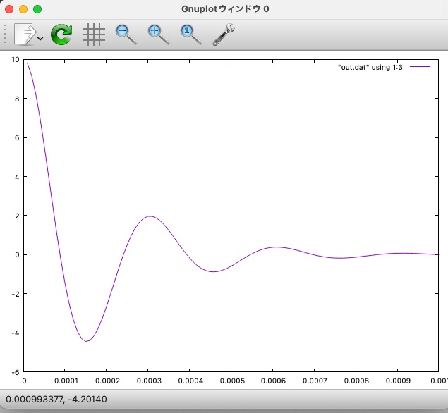

# RLC-series
This code solves the RLC series circuit using [GSL](https://www.gnu.org/software/gsl/) for differential equation solver. The system parameters are L=47mH, C=47 nF, and R=500 ohm. The initial voltage is 10 V.

Use the following command to compile.

  gcc rlc-series.c -o rlc-series -lgsl -lgslcblas -lm

See the Figure 2 (a) of ["mit-2006 text".](https://ocw.mit.edu/courses/6-071j-introduction-to-electronics-signals-and-measurement-spring-2006/a929d33896839a7bf1ca2631cd87e711_16_transint_rlc2.pdf)

From the book ["Computer simulation with C and EGGX"](http://web.cc.iwate-u.ac.jp/~nisidate/main.pdf).

[Kazume NISHIDATE](https://sites.google.com/site/nisidatelab/file-cabinet/the-team?authuser=0)

